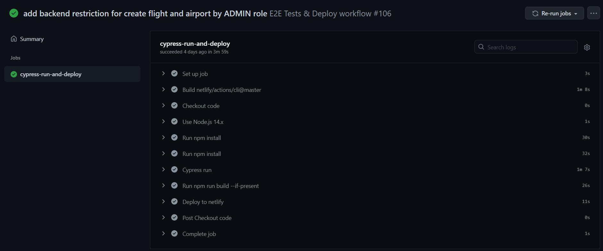
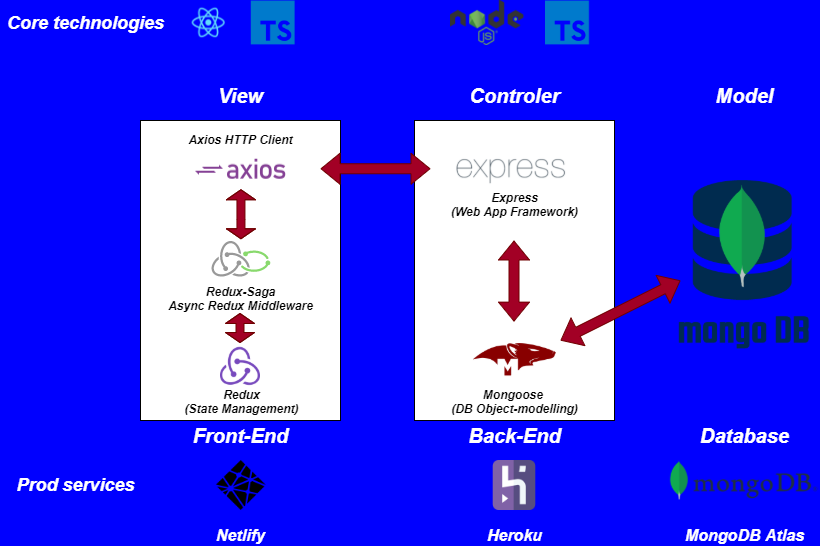
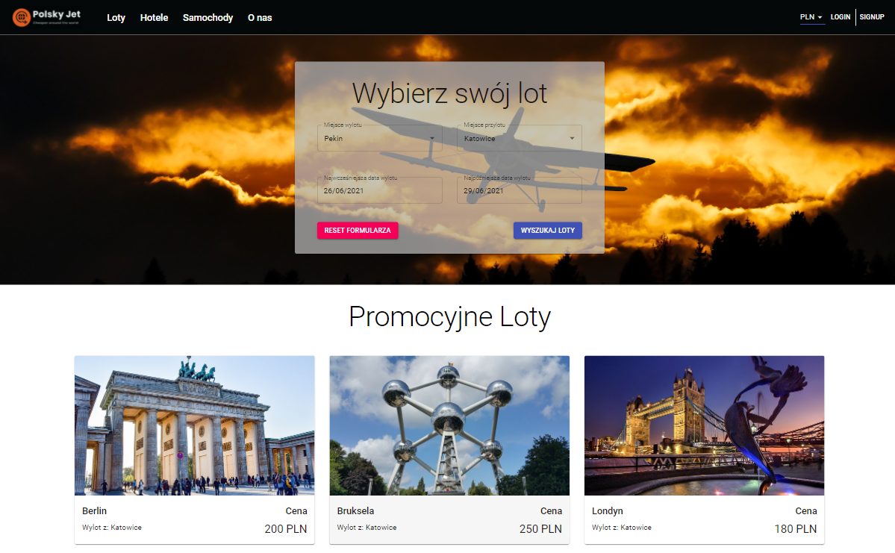
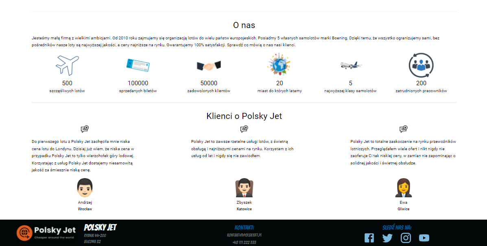
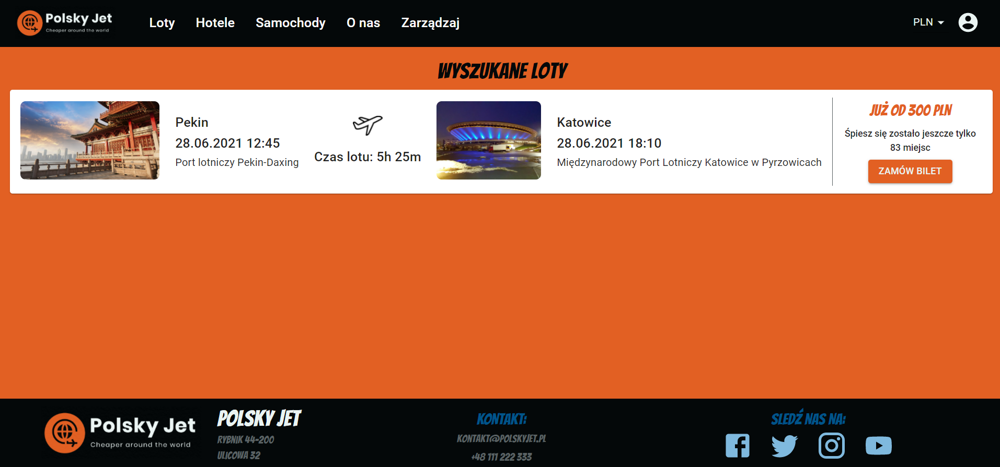
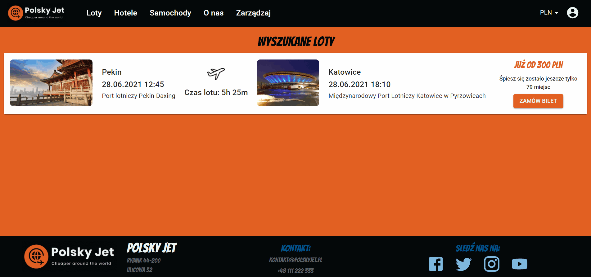
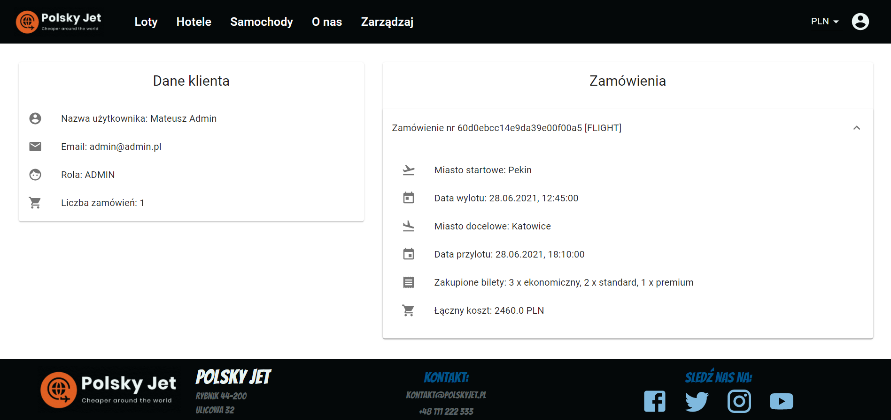
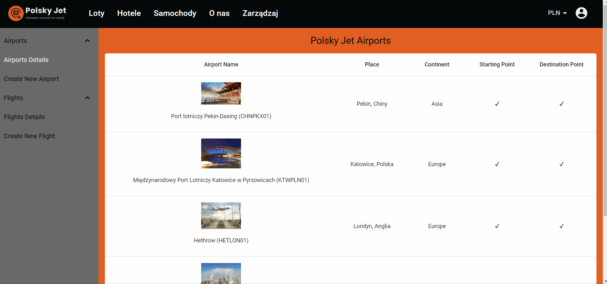

# Polsky Jet App v0.95
This is page (app) of Polsky Jet fake airlines. This app is a final part of my Front-End with Angular Programming postgraduate studies. App contains tons of nice and user-friendly features. TO get familiar with them read documentation below. 

!NOTE: Every version below v1.0 may have bugs in production (link below). That's why better to test this app on local environment. Every bigger prod bugs will be fixed with v1.0 release.

<br>

### LIVE PRODUCTION DEMO
https://polskyjet.netlify.app/
### PROJECT SCRUM BOARD
https://trello.com/b/b78x10Dj/polsky-jet-scrum-board

<br>

## Table of Contents

- [Setting Up Polsky Jet Project](#setting-up-polsky-jet-project)
- [NPM Scripts](#npm-scripts)
- [GIT Flow Description](#git-flow-description)
  - [Pre-commit](#pre-commit)
  - [Pre-push](#pre-push)
  - [Post-push](#post-push)
  - [Back-End Heroku Deploy](#back-end-heroku-deploy) 
- [Technologies in project](#technologies-in-project)
  - [Back-End](#back-end)
  - [Front-End](#front-end)
  - [Testing](#testing)
- [Architecture](#architecture)
- [Project Structure](#project-structure)
- [App Functionality](#app-functionality)
  - [Key Features](#key-features)
  - [Further feautres](#further-features)
- [Author](#author)
---
<br>

## Setting Up `Polsky Jet` project

<br>

1. Start by cloning the project with the command:
  ```
  git clone https://github.com/mateusz24polok/Polsky-Jet-Airlines.git
  ```
2. Then in root directory type command:
  ```
  npm install
  ```
3. In the next step go to the client directory and also type the same, so:
  ```
  cd client
  npm install
  ```
4. Prepare your environment variables script (specificly with config.env name) in server\src\config.env directory and provide following variables:
- PORT - localhost port for Backend API
- MONGODB_URI - your Mongo DB address
- JWT_SECRET - secret JWT signature (with min 32 signs)
- JWT_EXPIRES_IN - JWT token lifetime (f.e. 1d)
- JWT_COOKIE_EXPIRES_IN - JWT Cookie lifetime
5. Do the similar thing in client directory with .env file and put there one variable for:
- OPEN_WEATHER_API_KEY - your key for Open Weather API

<br>

## NPM Scripts
Fire up all following commands from root directory

<br>

### Run Fullstack App (Front-End with Back-End server)
```
npm run app:dev
```
### Run only Back-End server (without Nodemon)
```
npm run server:start
```
### Run only Back-End server (with Nodemon)
```
npm run server:dev
```
### Build Back_end server
```
npm run server:build
```
### Run only Front-End app (without Back-End)
```
npm run client:start
```
### Build Front-End app
```
npm run client:build
```
### Run Cypress
```
npm run cypress
```
### Run Cypress in headless mode
```
npm run cypress:headless
```

<br>

## GIT Flow Description
In this project Back-End is deployed on Heroku manually (which is described below), but most of CI/CD automation stuffs are implemented on Front-End side. Pre-commit and Pre-push works are based on Husky Hooks. Moreover post-push CI/CD part are based on GitHub Action.

### Pre-commit
Pre commit works contain two lint-staged job:

1. Check all Front-End project with ESLint rules (with fixing)
2. After ESLint checking code has been reformatted (if it needs to be) with Prettier

### Pre-push
On pre push stage Unit Tests with React Testing Library has been fired up

### Post-push
After pushing local branch to remote repository GitHub Action job named cypress-run-and-deploy has been fired up. This job has following steps:

1. Install and init Front-End and Back-End projects
2. Run Cypress E2E tests in headless mode
3. If every part of E2E will end successfuly then Front-End project has been builded
4. After that in last step Front-End project has been deployed to the production on Netlify



### Back-End Heroku Deploy
Please deploy app on Heroku always after merged Pull Request. Then the steps are following:

1. Switch to main branch
2. Pull current remote branch
3. Login into the Heroku via Heroku CLI and command heroku login
4. Deploy to the Heroku using command: git push heroku main

<br>

## Technologies in project
### Back-End
- Node.JS - JavaScript RunTime
- TypeScirpt - JavaScript's types superset
- Express.js - Web App Framework
- Mongoose - MongoDB Object Modelling
- BcryptJS - Passwords encrypting library
- JsonWebToken - JWT implementation library
- Multer - Node.js middleware for handling multipart/form-data


### Front-End
- HTML 
- CSS with Material UI framework
- TypeScript - JavaScript's types superset
- React - Front End Framework
- Webpack with Babel - Front End bundler
- Redux - Global State Management
- Redux-Saga - Async actions Redux middleware
- React-Router - app routing handling
- Formik - form handling library
- Yup - in cooperation with Formik helps validate forms
- Axios - Promises based HTTP Client  
- Notistack - Notification library which provide UI Snackbars notifations
- React-scroll - Library which provide component for animating vertical scrolling
- JWT-Decode - Small browser library that helps decoding JWTs token

### Testing
- Jest with React Testing Library on Front-End for Unit Tests 
- Cypress for E2E flow tests 

<br>

## Architecture


<br>

## Project Structure
```
.                                // Root directory
├── .vscode                      // VS Code specific settings
|
├── client                       // Client project directory
|   |
|   ├── build                    // Output from TypeScript build for website
|   |── node_modules             // NPM dependiences for Front-End project
|   |── res                      // Front-End App resources directory
|   |   ├── data                 // Storage for basic constant project data
|   |   ├── images               // Images resources for Front-End App
|   |   |── res.images.ts        // Script which export all images to res.ts
|   |   |── res.routes.ts        // Script with all app routes
|   |   |── res.routesPaths.ts   // Scirpt which exports all paths outside
|   |   |── res.settings.ts      // Storage for basics custom app settings, export stuff to res.ts
|   |   |── res.ts               // Scripts which exports settings and images outside
|   |   └── theme.ts             // Material UI theme settings
|   |
|   |── src                      // Basic directory for Front-End App
|   |   ├── components           // Storage for app components
|   |   ├── containers           // Storage for app conainers (bigger structure than component which contains a few components)
|   |   |── layout               // Storage for app layout (the biggest structure which provide routing and snackbar notifacation to the app)
|   |   |── pages                // Storage for every particular page of the app
|   |   |── services             // Axios instances to communicate with Back-End REST API
|   |   |── store                // Configuration, slices and sagas for React-Redux
|   |   |── types                // Types for Front-End App
|   |   |── utils                // Storage for generic functions, spread throug all the App
|   |   |── App.tsx              // Main App component
|   |   |── index.tsx            // Place where ReactDOM render main component and attach it to html
|   |   └── index.html           // Main HTML file for Front-End project
|   |
|   ├── webpack                  // Webpack configuration files
|   ├── .babelrc                 // Babel configuration file
|   ├── .eslintrc.js             // ESLint configuration file
|   ├── .prettierrc.js           // Prettier configuration file
|   ├── importJestDOM.ts         // React-Testing-Library util import file
|   ├── package.json             // Contains NPM dependencies and build scripts for the App
|   ├── tsconfig.json            // Configuration settings for compiling code written in TypeScript
|   ├── tsconfig.eslint.json     // ESLint extend for tsconfig.json
|   └── jest.config.js           // Jest configuration file
|
├── cypress                      // Basic cypress directory for E2E tests
├── docs_resources               // Documentation resources files
├── node_modules                 // NPM dependencies for server side
├── server                       // All of the code for server app
|   ├── dist                     // Output build directory for server app
|   └── src                      // All of the source code for server app
|       |── controllers          // Controllers respond to various http requests
|       |── mocks                // Mocks for filled DB from scripts
|       |── models               // Server specific type definitions, and DB schemas
|       |── routes               // Server routing configuration
|       |── utils                // Server utility functions
|       |── app.ts               // Express server intialization
|       └── server.ts            // Entry point of the server app
|
├── .gitignore                   // Defines which files or folders should be exclude from git
├── cypress.json                 // Cypress settings
├── package.json                 // Contains NPM dependencies and build scripts for the Back-End App
├── Procfile                     // Set init command for Heroku deployment
├── readme.md                    // Project documentation
└── tsconfig.json                // Config settings for compiling server code written in TypeScript
```

<br>

## App Functionality
Entry point of this app is main page of Polsky Jet fake airlines company, which is fully responsive and is accessible for all devices (mobile and desktop).
<br>

On the top of this page there is an AppBar menu which conains links to different categories. One of this categories which is offer management is hidden for normal user and it's only accessible for admin users after login.
<br>

On the left side of this bar there is a login bar with one of the main feature - dynamic currencies select and buttons for sign up and login. 
<br>

### Key Features
- Main Page with AppBar and flight search engine (Top of main page)

<br>

- Bottom of main page with brand details and customer contact

<br>

- Authorization functionality

<br>

- Flight Search Engine

<br>

- Flight List

<br>

- Flight Purchase Multistep Form with weather accept

<br>

- User details 

<br>

- Management System for admin users with navtree menu 

<br>

- Airports Management System 

<br>

- Flight Management System 


<br>

### Further features
- Terminals option in airports
- Remove flight and airport feature in Admin Management System
- Improve RWD stuffs
- More Unit & E2E Tests

<br>

# Author
- author: Mateusz Polok
- email: mateusz24polok@gmail.com
- phone: +48535731868
